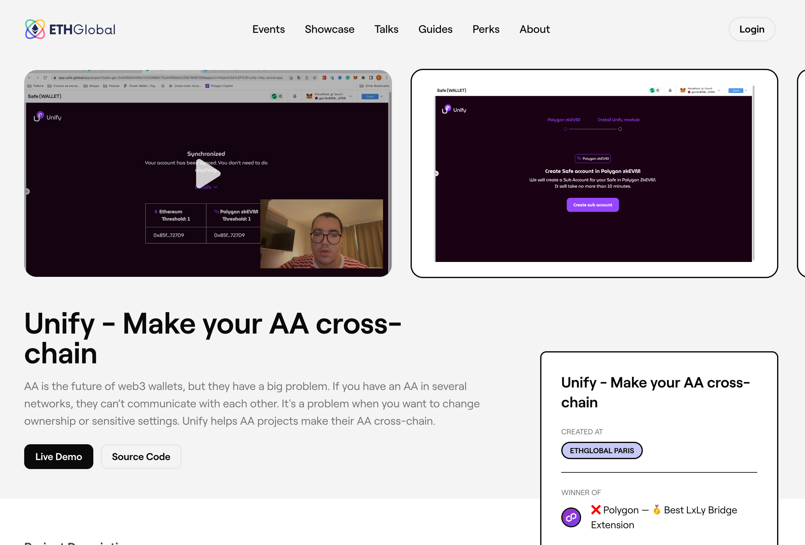
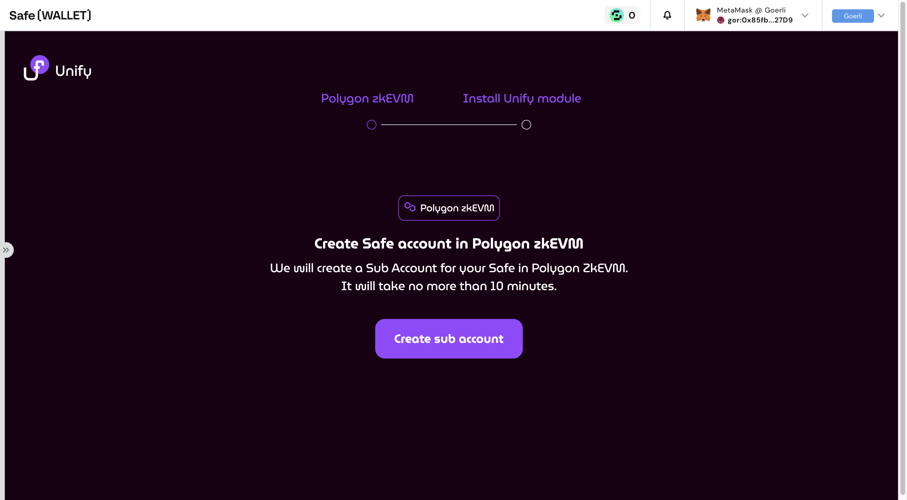
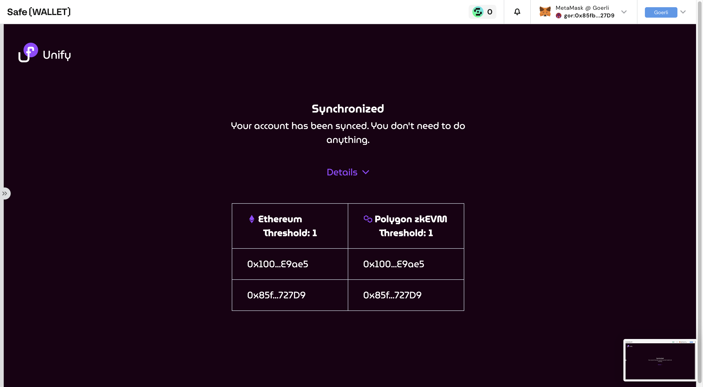
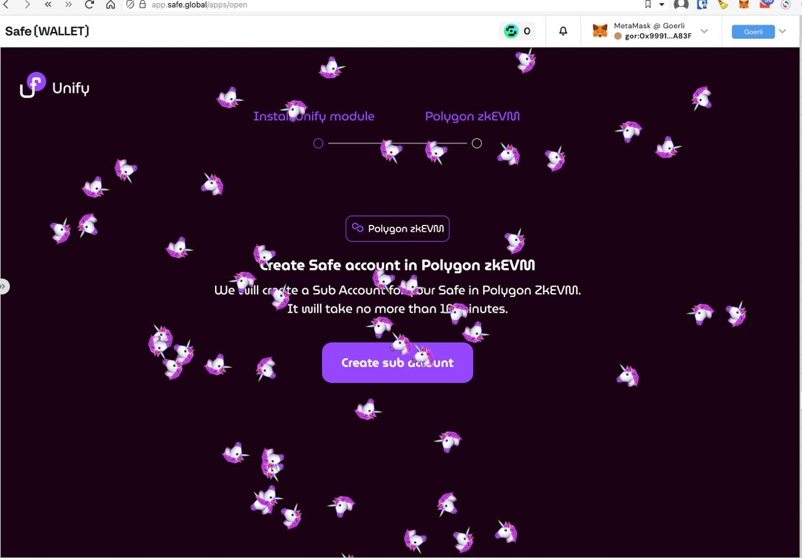

# Project `Unify` (Account Abstraction)

## Frontend for ETHGlobal hackathon

> 🎉 Winner of the track "Polygon — 🥇 Best LxLy Bridge Extension"

Check out our project page on ETHGlobal site
https://ethglobal.com/showcase/unify-make-your-aa-cross-chain-a4x7h

## Description

Account Abstraction is the future of web3 wallets, but they have a big problem. If you have an
Account Abstraction in several networks, they can’t communicate with each other. It's a problem when
you want to change ownership or sensitive settings. Unify helps Account Abstraction projects make
their Account Abstraction cross-chain.

## Tech

Ethereum, Polygon zkEVM and Gnosis Safe

## Links

Safe App (Code): https://github.com/maxmonakhov/unify (this repo)

Contracts: https://github.com/elshan-eth/unify-contracts

Safe App URL: https://unify-inky.vercel.app/

## DEMO (Flow for testing)

1. Create a [Safe](https://safe.global) with several owners
2. Open Custom Apps in your Safe Web Wallet
3. Enter https://unify-inky.vercel.app/ in the URL for the Safe App
4. Follow the steps in the Unify Safe App. One step can run up to 5 minutes, so don't turn off the application.
5. Change owners in Safe Web Wallet
6. Open the Unify Safe App and call sync. This may take up to 15 minutes.
7. Finish. Your account is synced 🚀

If you had several Safe accounts without Unify on, for example, 10 L2 chains, you would need to make 10 clicks and transactions. With Unify, just **one** transaction is enough to update the data for all your L2.

## Screenshots

